# Directions to the Cyber Range

## Where is Wannalancit ?

The Cyber Range is located in the Wannalancit building on the East Campus.

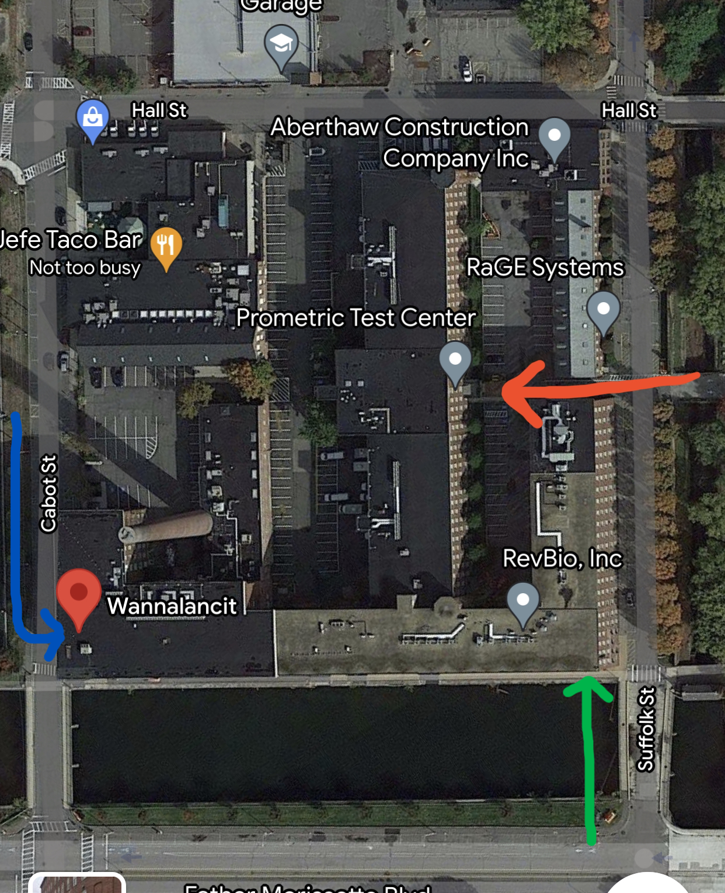

## Building Entrances

There are three entrances to the building that will lead to the cyber range (the three arrows in the image above):

- [175 Cabot St Entrance to Cyber Range (Blue Arrow)](#175-cabot-st-entrance-to-cyber-range)
- [600 Suffolk St Entrace to Cyber Range (Green Arrow)](#600-suffolk-st-entrace-to-cyber-range)
- [650 Suffolk St Entrance to Cyber Range (Orange Arrow)](#650-suffolk-st-entrance-to-cyber-range)

## Accessing the Building

Please note that the building is locked on weekends and after certain hours. However, you can still access the building through the security entrance, as shown in the image below. Simply inform the security guard that you are a member of the UML Cyber Security Club. Then you can go through the [650 Suffolk St Entrance](#650-suffolk-st-entrance).

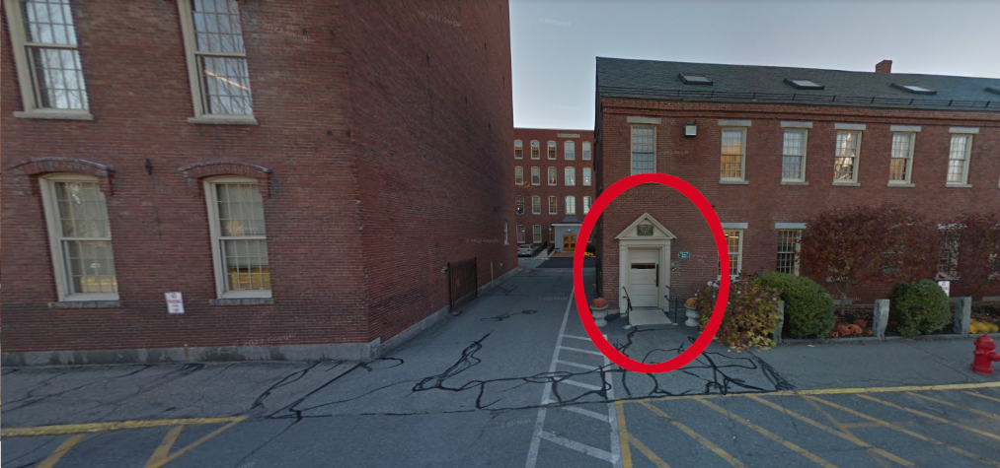

## Directions to the Cyber Range

You can follow the [video](#video-directions) or [non-video directions](#non-video-directions) to reach the cyber range.

## Video Directions

Click on the image below to watch a YouTube video with instructions on how to get to the cyber range once in the building.

## Non-Video Directions

### 175 Cabot St Entrance 

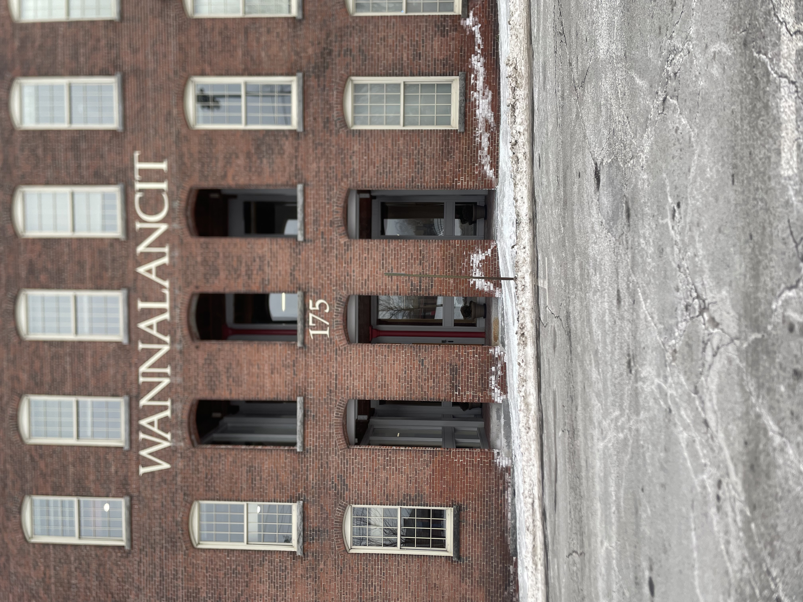

#### Inside the Building 

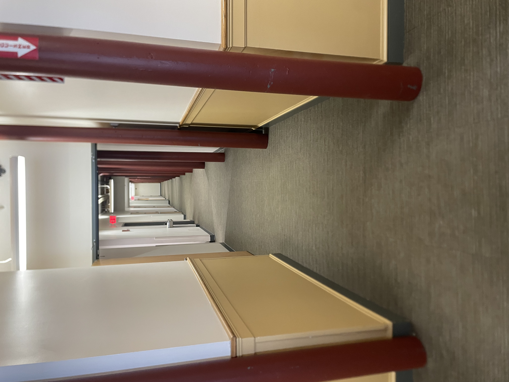

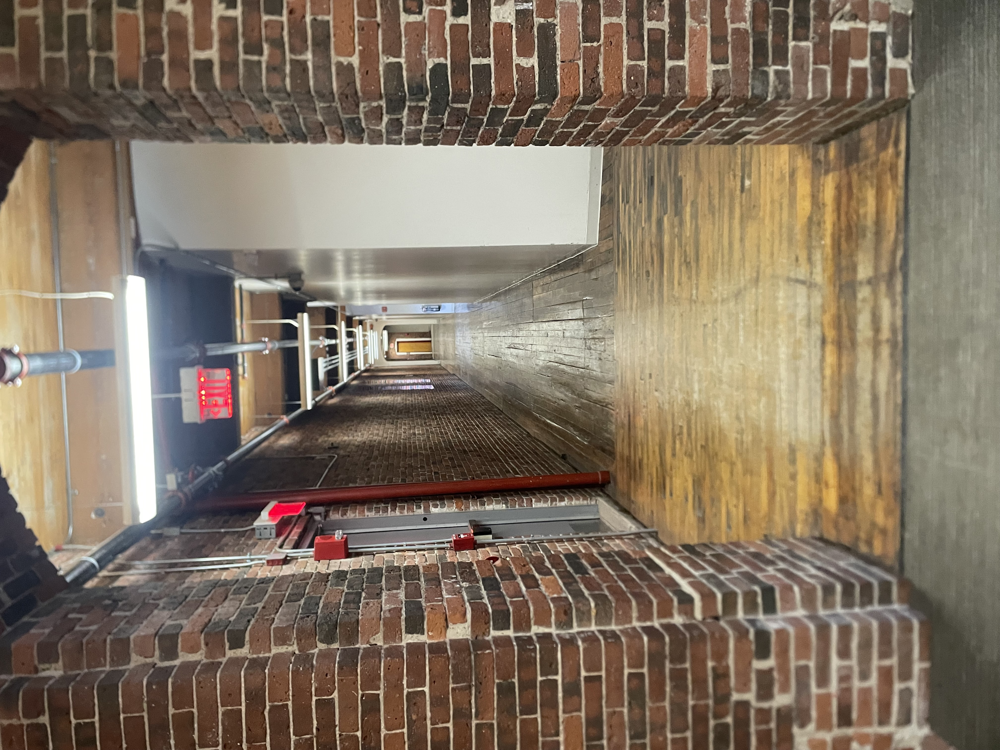

**Once you reach the third hallway, you can take the left red arrow to go up the stairs or the blue arrow to the right will bring you to the elevator. You will want to get to the fourth floor.**

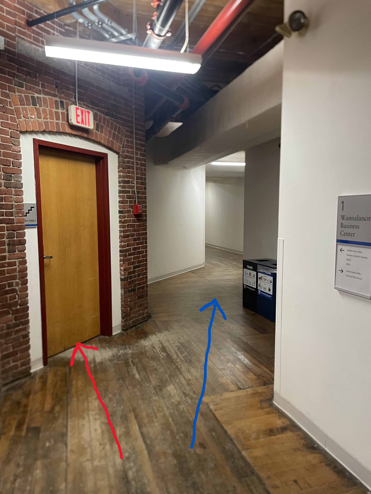

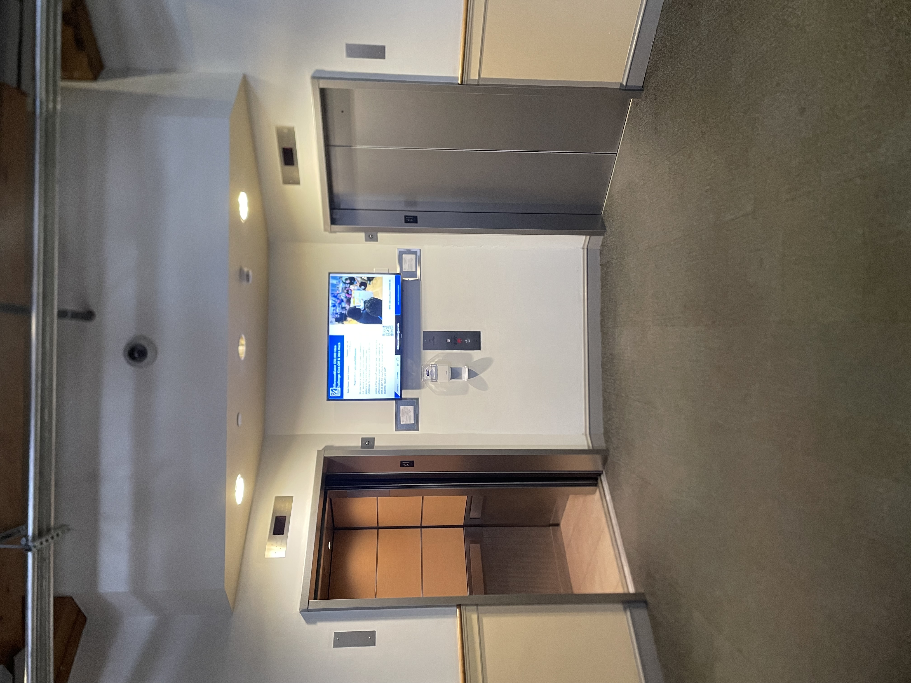

### 600 Suffolk St Entrace

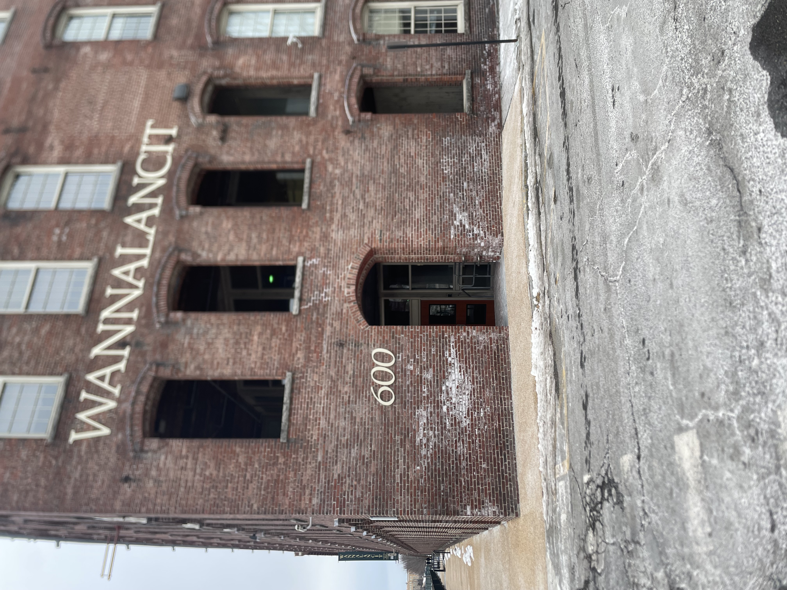

#### Inside the Building 

### 650 Suffolk St Entrance

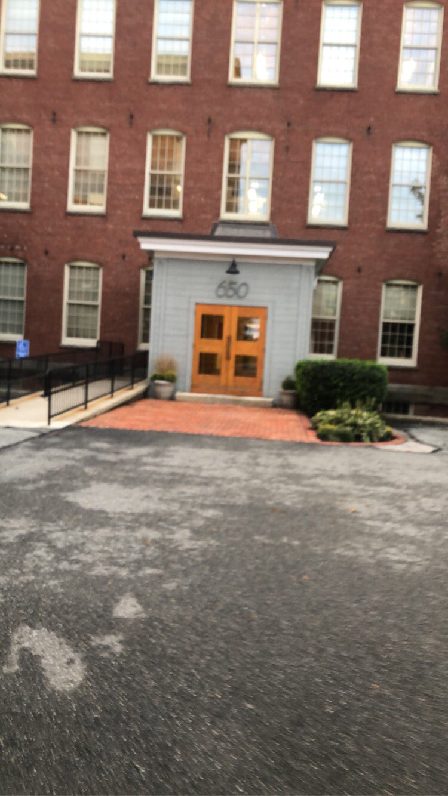

### Inside the Building

Follow the hallways as shown in the images below:

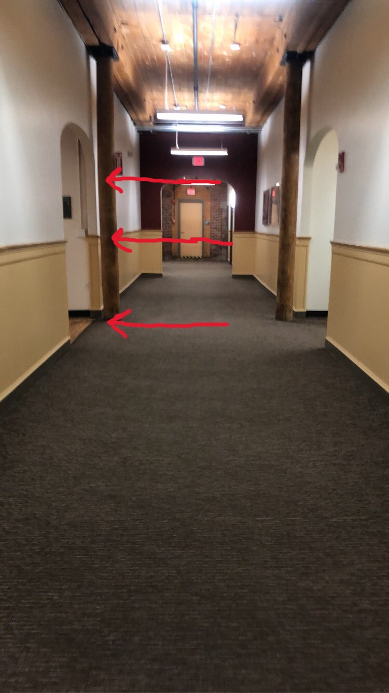
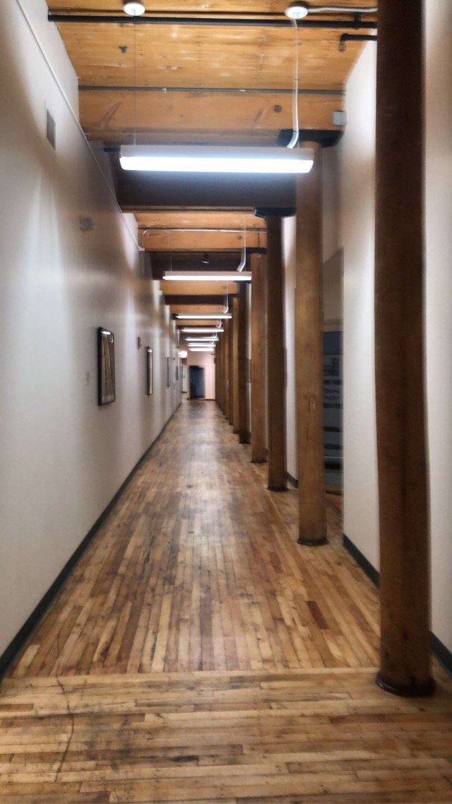

**Once you reach the third hallway, you can take the left red arrow to go up the stairs or the red arrow to the right will bring you to the elevator. You will want to get to the fourth floor.**

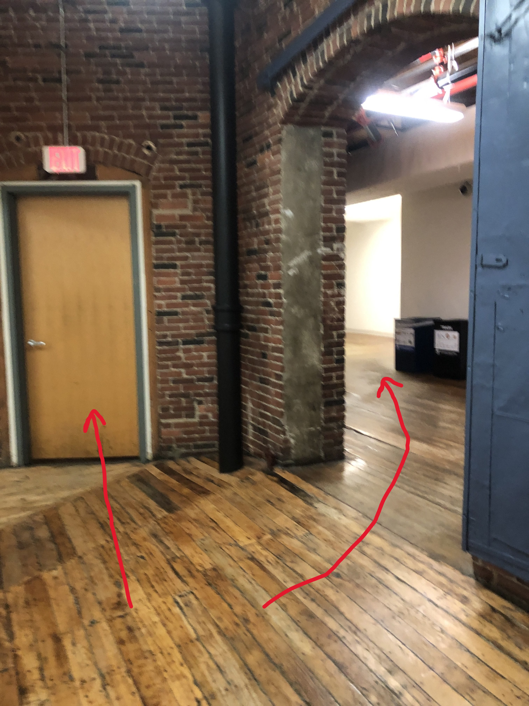

